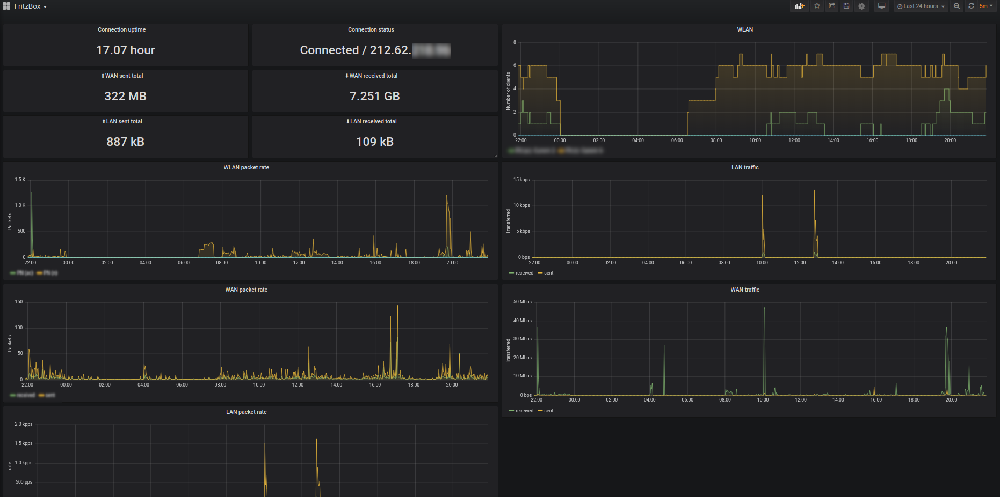

# FritzBox UPnP Prometheus Exporter

- build on top of UPnP
- tested with 7490 and 7590

## Currently exposed metrics

- `fb_lan_eth_total_bytes_received`
- `fb_lan_eth_total_bytes_sent`
- `fb_lan_eth_total_packets_received`
- `fb_lan_eth_total_packets_sent`
- `fb_wan_total_bytes_received`
- `fb_wan_total_bytes_sent`
- `fb_wan_total_packets_received`
- `fb_wan_total_packets_sent`
- `fb_wanppp_status_uptime`
- `fb_wlan_number_associations`
- `fb_wlan_total_packets_received`
- `fb_wlan_total_packets_sent`

## Test with curl
```
$ curl localhost:8080/metrics

# HELP fb_lan_eth_total_bytes_received LAN ethernet total bytes received
# TYPE fb_lan_eth_total_bytes_received counter
fb_lan_eth_total_bytes_received 6.02005e+06
# HELP fb_lan_eth_total_bytes_sent LAN ethernet total bytes sent
# TYPE fb_lan_eth_total_bytes_sent counter
fb_lan_eth_total_bytes_sent 1.288697988e+09
# HELP fb_lan_eth_total_packets_received LAN ethernet total packets received
# TYPE fb_lan_eth_total_packets_received counter
fb_lan_eth_total_packets_received 81931
```

## Run with docker
Docker image runs on arm (raspberry pi etc.) and x68 / x86-64
Start docker container with following `docker-compose.yml` file (change username and password):
```yml
version: '2.1'
services:
   fritzbox-prometheus:
      image: spx01/fritzbox-prometheus
      container_name: fritzbox-prometheus
      environment:
         - FB_USERNAME=...
         - FB_PASSWORD=...
      ports:
         - 8086:8080
      restart: always
```

## Grafana dashboard
Example grafana dashboard definition [as JSON](grafana.json)
. 